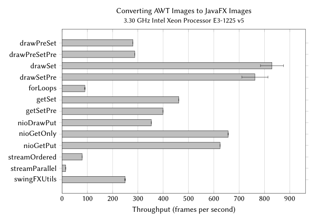
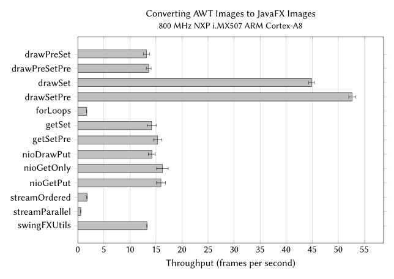

# AWT to JavaFX Image Conversion Benchmarks

This project looks at ways to convert an AWT image to a JavaFX image as alternatives to the method provided by [`SwingFXUtils.toFXImage`](https://github.com/javafxports/openjdk-jfx/blob/develop/modules/javafx.swing/src/main/java/javafx/embed/swing/SwingFXUtils.java). It compares the performance of the various methods using the [Java Microbenchmark Harness](https://openjdk.java.net/projects/code-tools/jmh/). The project includes benchmarks that use the `PixelBuffer` class proposed by [pull request #472](https://github.com/javafxports/openjdk-jfx/pull/472), "JDK-8167148: Add native rendering support by supporting WritableImages backed by NIO ByteBuffers."

## Licenses

The content of this project is licensed under the [GNU General Public License v3.0](https://choosealicense.com/licenses/gpl-3.0/) except for the following files, which are licensed under the [Creative Commons Attribution-ShareAlike 4.0 International](https://choosealicense.com/licenses/cc-by-sa-4.0/) license:

* the file [doll-dancing.gif](src/main/resources/doll-dancing.gif), and
* the bar charts found in the [*images*](images/) directory.

## Building

This is a Maven project of the [Apache NetBeans IDE](https://netbeans.apache.org/) with the *javafx.graphics* and *javafx.base* modules installed in the local repository. See the following shell scripts in the *bin* directory for ways to install the JavaFX 13 development artifacts locally.

* [mvninstall.sh](bin/mvninstall.sh) - Installs the artifacts from a JavaFX SDK
* [syncopenjfx.sh](bin/syncopenjfx.sh) - Updates the artifacts from a JavaFX build machine

## Running

Run a quick test with a command like the following:

```ShellSession
$ $HOME/opt/jdk-12.0.1/bin/java \
    -Djava.library.path=$HOME/lib/javafx-sdk-13-dev/lib \
    -jar target/benchmarks.jar -f 1 -i 1 -wi 1
```

Run the benchmarks with their default options for a more thorough test:

```ShellSession
$ $HOME/opt/jdk-12.0.1/bin/java \
    -Djava.library.path=$HOME/lib/javafx-sdk-13-dev/lib \
    -jar target/benchmarks.jar
```

The `-h` option prints a description of all JMH command options:

```ShellSession
$ $HOME/opt/jdk-12.0.1/bin/java -jar target/benchmarks.jar -h
```

## Results

The chart below shows the results of the tests on a Dell Precision Tower 3420 workstation. The [Dell log file](logs/dell-2019-06-27.log) contains the test output.



The chart below shows the results of the tests on a Kobo Touch N905B e-reader. The [Kobo log file](logs/kobo-2019-06-27.log) contains the test output.


